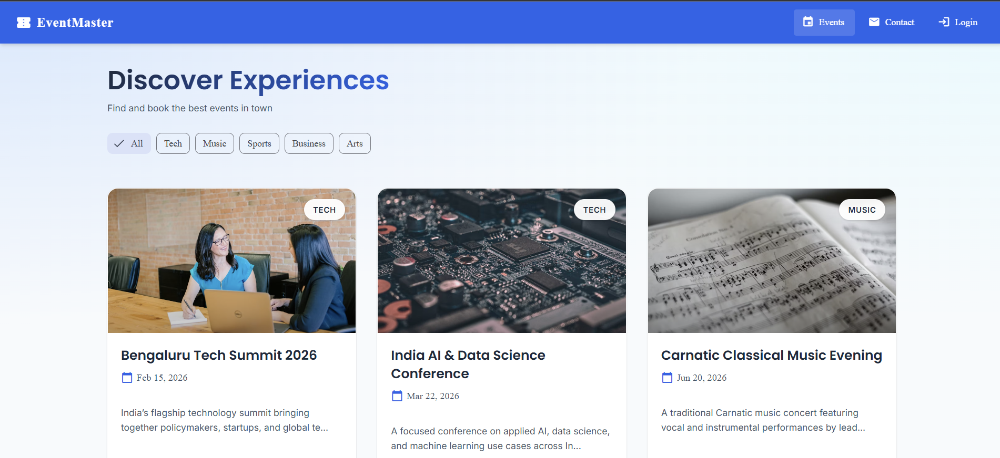
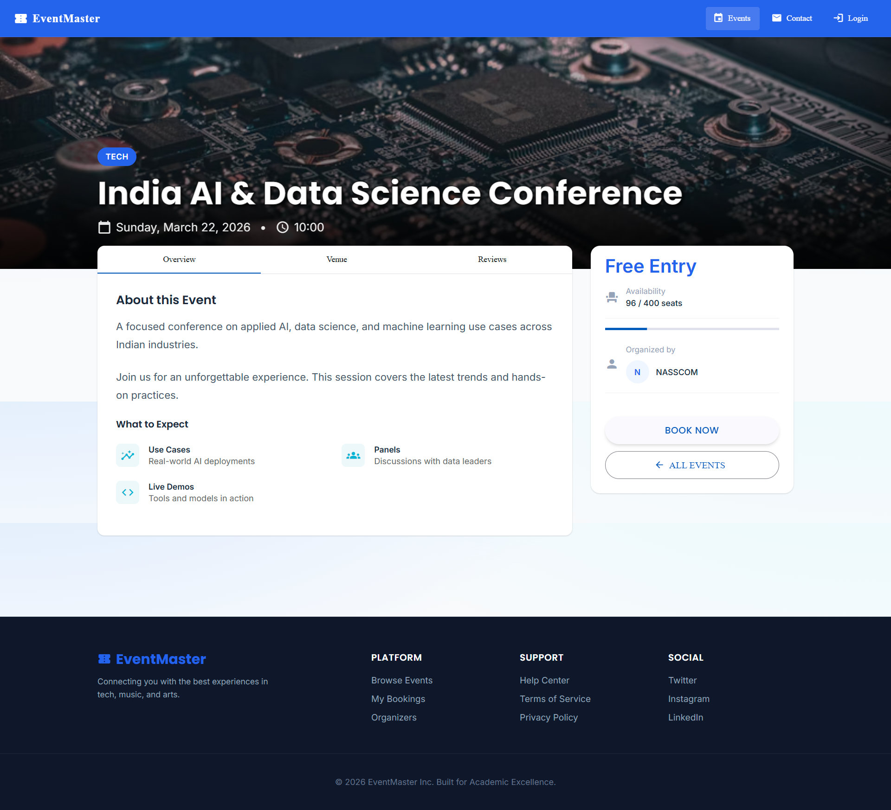
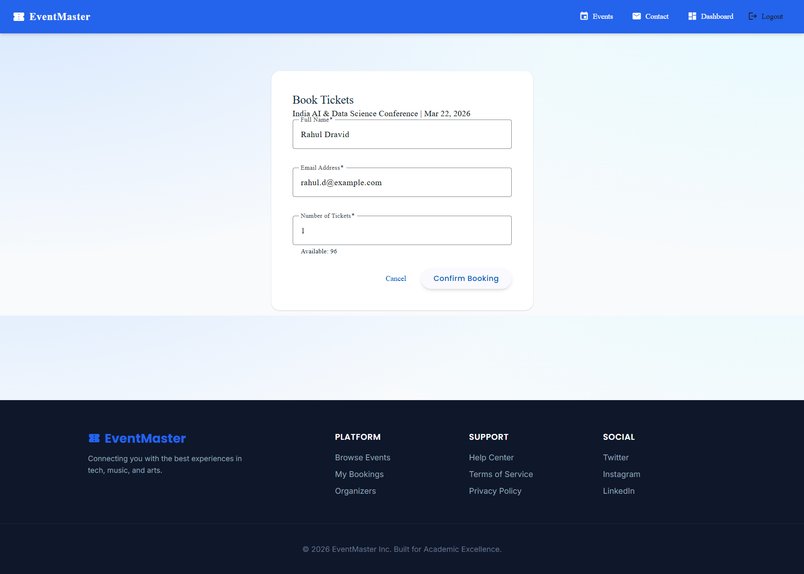
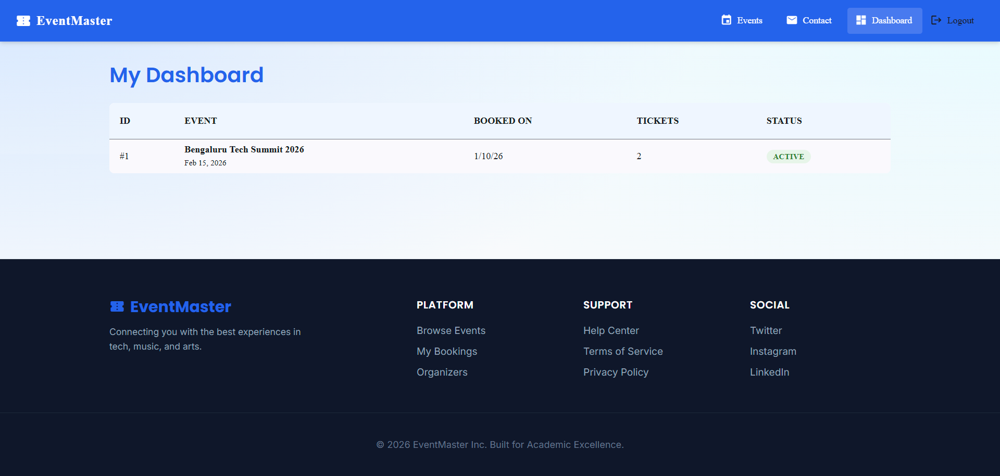

<h1 align="center">EventMaster</h1>
<p align="center"><strong>Event Management & Ticket Reservation System</strong></p>

<p align="center">
   <a href="https://angular.io/"></a>
   <a href="https://www.typescriptlang.org/"></a>
   <a href="https://material.angular.io/"></a>
   <a href="https://responsive.is/"></a>
</p>

EventMaster is a full-featured Event Management and Ticket Reservation System built with **Angular 17**. It demonstrates real-world Angular architecture, secure booking workflows, and responsive UI design. The project is designed for academic evaluation, portfolio presentation, and Angular best-practice learning.

## Color Reference

| Purpose         | Hex     | Usage                            |
| --------------- | ------- | -------------------------------- |
| Primary         | #0277BD | Headers, Buttons, Active States  |
| Accent          | #00BCD4 | Secondary Actions, Highlights    |
| Success         | #4CAF50 | Bookings Confirmed, Valid States |
| Warning         | #FF9800 | Low Availability, Alerts         |
| Dark Background | #F5F5F5 | Light Theme Background           |

## 🚀 Key Features

- **Event Discovery**: Browse upcoming events with real-time category filtering.
- **Immersive Details**: Rich event pages featuring high-resolution banners, sticky booking cards, and tabbed information (Overview, Venue, Agenda).
- **Ticket Reservation**: Secure booking flow using **Reactive Forms** with custom validation (seat availability checks).
- **User Dashboard**: Private area (protected by Auth Guards) to track booking history and reservation status.
- **Responsive Design**: Fully optimized for Desktop, Tablet, and Mobile using Material Design principles.
- **Performance**: Optimized lazy-loading for all feature modules.

## 🛠️ Tech Stack

- **Framework**: Angular 17+
- **Styling**: Angular Material & Custom CSS (Blue/Cyan Palette)
- **Data Handling**: RxJS Observables & HttpClient
- **Icons**: Material Icons
- **Fonts**: Roboto

## 📂 Project Architecture

The project follows a **Modular Feature-based Architecture**:

- `CoreModule`: Application-wide singletons (Services, Guards, Interceptors).
- `SharedModule`: Reusable UI components, Pipes, and Directives.
- `FeatureModules`: Lazy-loaded modules for `Events`, `Booking`, and `Dashboard`.

## ⚙️ Setup & Installation

### Prerequisites

- Node.js (v18+)
- npm or yarn
- Angular CLI v17+

### Getting Started

1. **Clone the repository**:

   ```bash
   git clone https://github.com/Adharsh2306/Event-Master
   cd event-management-system
   ```

2. **Install Dependencies**:

   ```bash
   npm install
   ```

3. **Run the Application**:
   ```bash
   ng serve
   ```
   Navigate to `http://localhost:4200/`.

## 🎓 Academic Alignment (Angular Concepts)

This project was developed as a benchmark for clean Angular architecture, demonstrating:

- **NgModule Pattern**: Strict adherence to modular organization.
- **Routing**: Parameterized routes, lazy loading, and `CanActivate` guards.
- **Dependency Injection**: Decoupled business logic in Services.
- **Forms**: Advanced **Reactive Forms** and **Template-driven** concepts.
- **RxJS**: Stream management with `switchMap`, `forkJoin`, and `BehaviorSubject`.
- **Custom Pipes/Directives**: `CategoryFilterPipe` and `HighlightEventDirective`.
- **Interceptors**: Global HTTP loading state management.

## 📊 Project Statistics

| Metric             | Value                             |
| ------------------ | --------------------------------- |
| Framework          | Angular 17                        |
| Total Components   | 10+                               |
| Feature Modules    | 3 (Events, Booking, Dashboard)    |
| Services           | 4 (Event, Booking, User, Loading) |
| Lazy-Loaded Routes | 3                                 |
| Guard Protection   | Auth Guard on Dashboard           |

## 📸 Project Screenshots

| **Event Discovery** | **Immersive Details** |
|:---:|
|  |  |
| *Browse upcoming events with filters* | *Rich details with tabs and sticky booking* |

| **Secure Booking** | **User Dashboard** |
|:---:|
|  |  |
| *Form validation and auth checks* | *Manage your reservations* |

## 📚 Documentation

- [API Specifications](API_SPECS.md) - RESTful API details
- [Routing Guide](routing.md) - Route configuration and protection
- [Project Structure](projectStructure.md) - Detailed folder organization
- [TODO List](TODO.md) - Upcoming features and improvements

## 🔗 API Integration

The application integrates with local JSON data sources:

- `events.json` - Event catalog with details and metadata
- `users.json` - User profiles and credentials
- `bookings.json` - Reservation records
- `venues.json` - Venue information

## ✨ Key Highlights

- ✅ **Type-Safe**: Full TypeScript implementation
- ✅ **Performance Optimized**: Lazy loading, Change Detection strategies
- ✅ **Accessible**: Material Design compliance
- ✅ **Well-Tested**: Unit tests for services and components
- ✅ **Production-Ready**: Error handling and loading states

## 🎓 Learning Outcomes

This project showcases practical implementation of:

- Advanced Angular architectural patterns
- RxJS reactive programming
- Material Design system
- Professional coding standards
- Component communication and state management

---
